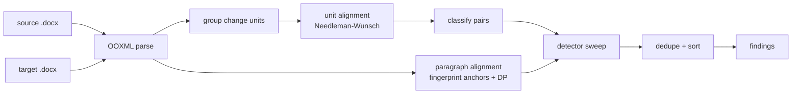

# tc-qa-checker

> Track-changes verification for bilingual DOCX translation files

[](https://github.com/rahulchandravanshi/tc-qa-checker/actions/workflows/ci.yml)
[](LICENSE)
[](https://www.python.org/)
[](https://github.com/astral-sh/ruff)

<!-- TODO: hero screenshot / animated GIF demo of the CLI output goes here. -->
<!--  -->

## What it does

When a source document is revised with tracked changes, a translator re-applies the
equivalent edits to the translated target. `tc-qa-checker` verifies that those edits were
carried across **faithfully** — without ever needing the two languages to match word for
word.

It parses the raw OOXML of both `.docx` files, extracts every insertion and deletion, and
aligns the source and target paragraphs using two independent strategies: a Needleman-Wunsch
alignment over the changed paragraphs, and a content-fingerprint alignment (numbers, product
codes, acronyms, dates) that is robust to translation drift. It then runs a pipeline of
deterministic detectors over the aligned pairs and reports a ranked list of findings.

Detectors in this release catch: a **number that diverges** between a source edit and its
target (e.g. the source amends a count to 35 but the target says 28), **numbers dropped**
from the target entirely, **untranslated insertions** (substantial new source text with no
target counterpart), and **seam artifacts** left in the accepted text by the compare/merge
process (doubled words, double spaces, missing sentence spacing). Table-of-contents entries
are suppressed, because their page numbers are regenerated automatically and never hand-edited.

## Why this exists

Track-changes implementation review is a stubbornly manual step in regulated and
high-consequence localization — someone opens two documents side by side and checks, edit by
edit, that every revision landed correctly in the translation. The hard part is **alignment**:
once the text is in another language you can no longer diff it directly, so naive tools either
miss real divergences or drown the reviewer in false positives. `tc-qa-checker` fills that gap
with translation-aware alignment plus a small set of high-precision, fully deterministic
checks — no model, no network, no per-document tuning.

## Quickstart

```bash
# install from source
pip install git+https://github.com/rahulchandravanshi/tc-qa-checker

# verify a translated revision
tc-qa-checker --source source_revised.docx --target target_revised.docx
```

```text
1 finding(s) — CRITICAL: 1

[CRITICAL] Wrong number in target (paragraph 42)
  Issue: Source INS contains [35] but target INS contains [28]. Target value diverges from source amendment.
  Suggestion: Verify the linguist used the source INS value. ... Replace the target numeral(s) with the source value(s): 35.
```

## Installation

```bash
# from GitHub
pip install git+https://github.com/rahulchandravanshi/tc-qa-checker

# from a local clone (editable, with dev tooling)
git clone https://github.com/rahulchandravanshi/tc-qa-checker
cd tc-qa-checker
python -m venv .venv && source .venv/bin/activate
pip install -e ".[dev]"
```

Requires Python 3.11+. The core has **no third-party runtime dependencies** beyond
[`typer`](https://typer.tiangolo.com/) for the CLI — DOCX parsing uses the standard library.

## Usage

```bash
# human-readable report (default)
tc-qa-checker --source source.docx --target target.docx

# machine-readable JSON, e.g. to pipe into another tool
tc-qa-checker --source source.docx --target target.docx --json

# tune the alignment skip cost (advanced); log pipeline progress to stderr
tc-qa-checker -s source.docx -t target.docx --skip-cost 60 --verbose
```

| Option | Default | Description |
|---|---|---|
| `--source`, `-s` | _required_ | Source `.docx` with tracked changes |
| `--target`, `-t` | _required_ | Target `.docx` with tracked changes |
| `--json` | off | Emit findings as a JSON array |
| `--skip-cost` | `50` | Needleman-Wunsch skip cost for unit alignment |
| `--verbose`, `-v` | off | Log pipeline progress to stderr |

## Library usage

```python
from tc_qa_checker import analyze_files, Severity
from tc_qa_checker.report import render_text, render_json

findings = analyze_files("source.docx", "target.docx")

print(render_text(findings))          # formatted report
print(render_json(findings))          # JSON string

# or work with the findings directly
criticals = [f for f in findings if f.severity is Severity.CRITICAL]
for f in criticals:
    print(f"para {f.para_idx}: {f.category} — {f.issue}")
```

Already have the bytes in memory? Use `analyze` instead of `analyze_files`:

```python
from tc_qa_checker import analyze

findings = analyze(source_bytes, target_bytes)
```

See [`docs/examples/`](docs/examples) for runnable scripts, including how to register a
custom detector.

## Configuration

`tc-qa-checker` is fully local and deterministic: there are no API keys, no network calls,
and no configuration files. The only knob is `--skip-cost` (library: the `skip_cost`
argument to `analyze`/`analyze_files`), which controls how readily the unit alignment leaves
a changed paragraph unmatched. The default of `50` suits most documents.

## How it works



1. **Parse** — read `word/document.xml` from each DOCX and extract per-paragraph accepted
   text plus every tracked insertion/deletion.
2. **Group** — collapse each paragraph's changes into a single change unit.
3. **Align** — match changed units positionally (Needleman-Wunsch), and separately align
   *all* paragraphs by content fingerprint. The fingerprint alignment is the more reliable
   of the two and is used to veto detectors when the positional alignment has drifted.
4. **Classify** — route each pair (prose, bullet, tiny, TOC, …) so detectors only run where
   they make sense.
5. **Detect** — run the registered detectors; a small registry makes the pipeline easy to
   extend.
6. **Finalize** — de-duplicate and sort by paragraph, then severity.

## Roadmap

- **Pluggable LLM adapter** — optional, provider-agnostic second pass for findings a
  deterministic rule can't express.
- **Source-Text-Analysis rules** — apply a structured forbidden/preferred-term checklist.
- **Reviewer feedback loop** — learn per-project rules from accept/reject decisions.
- **More inputs** — XLIFF and bilingual-table formats alongside DOCX.
- **Report exports** — standalone HTML / annotated DOCX output.

## Contributing

Contributions are welcome — see [CONTRIBUTING.md](CONTRIBUTING.md) for dev setup and the
lint/type/test workflow.

## License

[MIT](LICENSE) © Rahul Chandravanshi

## Acknowledgements

Built on the Python standard library for OOXML parsing and
[Typer](https://typer.tiangolo.com/) for the CLI. Inspired by the day-to-day realities of
bilingual track-changes review in regulated localization.
